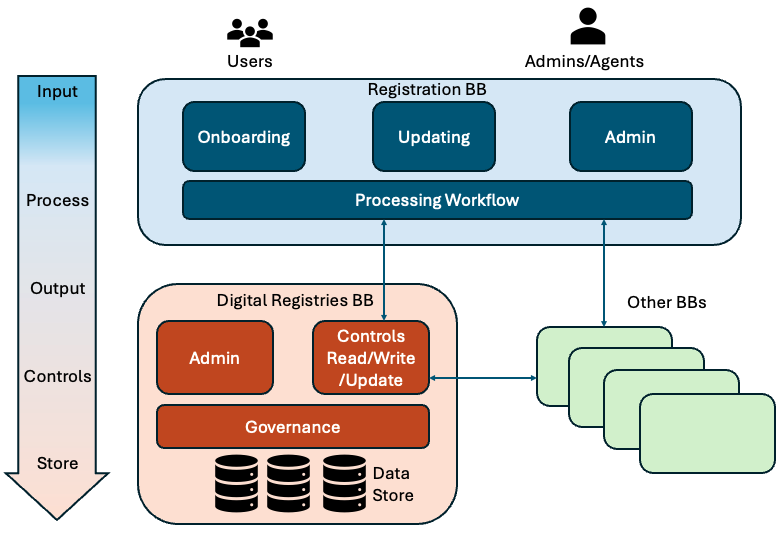

# 2 Description

The **Digital Registries Building Block (BB)** is a trusted, authoritative service for uniquely identifiable records about entities such as persons, organisations, places, assets, and events. It is designed to act as the **single source of truth** within the GovStack ecosystem, ensuring consistency, reliability, and accountability in the use of registry data.

The Digital Registries BB enables other Building Blocks, government institutions, and external systems to capture, validate, store, search, distribute, and access registry record in a secure and standardised and uniquely identifiable manner. By abstracting the complexity of underlying databases, it exposes consistent service APIs that allow seamless integration and reuse across multiple domains and applications. This can involve logically assembling a record from multiple underlying databases. The Building Block also ensures audit-able logs of changes to the data and registry structures.

The Digital Registries BB provides functionality to maintain registry data and administer and create registries. As such it is a **generic, domain-agnostic solution**. It can be applied across multiple sectors and contexts, including but not limited to:

* Civil registration (births, deaths, marriages, etc.)
* Ownership of property, vehicles, and other assets
* Health and medical information
* Banking and commercial transactions
* Education and qualifications
* Land surveys and manufacturing details

Given the diversity of such information, this Building Block provides services useful to abstract the structure, linkages, and grouping of information into various records and collections such as financial, legal, medical, social, educational, commercial, etc., as needed.

The Digital Registries BB works in close coordination with other GovStack components:

* **Registration BB** – an interface for citizens (applicants) and/or government officials (operators) to manage the life-cycle of claims in a registry.
* **Foundational ID BB** – for uniquely identifying entities.
* **Workflow BB** – for orchestrating business processes tied to registry data.
* **Information Mediator / Consent & Authorisation** – for secure, policy-driven data exchange across organisations.

The Digital Registries Building Block is an optional Building Block for other GovStack Building Blocks that have the need to store information. Any traditional database platform could be used alone or in combination with Digital Registries Building Block. The Digital Registries Building Block can operate as a standalone service and could be implemented as one centralized instance per domain, containing multiple registries in one instance, or many instances per domain, each database in its own server.

<figure><figcaption></figcaption></figure>
