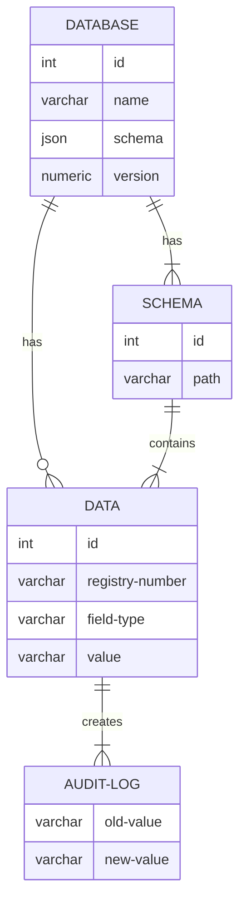

# 7 Data Structures

## 7.1 Resource Model

The resource model shows the relationship between data objects that are used by this Building Block.

## 7.2 Data Structures 

The Data Structures provide detail for the Resource Model defined above. This section will list the core/required fields for each resource.&#x20;

### 7.2.1 Minimum Required Data

**Description:** The Data Structures can be extended for a particular use case, but they must always contain, at the minimum, the fields defined here.

**Fields:**

<table><thead><tr><th>Name</th><th>Type</th><th>Description</th><th>Notes</th><th data-hidden></th></tr></thead><tbody><tr><td>Database ID</td><td>integer</td><td>Unique identifier of a database.</td><td>Required</td><td></td></tr><tr><td>Database name</td><td>varchar</td><td>Name that will define the database content. Name is public.</td><td>Required</td><td></td></tr><tr><td>Schema ID</td><td>integer</td><td>Database schema ID</td><td>Required</td><td></td></tr><tr><td>Database schema</td><td>json</td><td>Database schema. See example in Chapters 7.3.1 and 7.3.2.</td><td>Required</td><td></td></tr><tr><td>Version</td><td>numeric</td><td>Database version. Each change in schema will produce the next version of the database and API services.</td><td>Required</td><td></td></tr><tr><td>Data ID</td><td>integer</td><td>Data element unique identifier.</td><td>Required</td><td></td></tr><tr><td>Registry number</td><td>varchar</td><td>Additional registry identifier. Unique identifier in the registry.</td><td>Required</td><td></td></tr><tr><td>Field type</td><td>varchar</td><td>Field type: datetime, date, boolean, text, number, file.</td><td>Required</td><td></td></tr><tr><td>Field value</td><td>datetime, date, boolean, text, number</td><td>Field value, data stored in the field.</td><td>Required</td><td></td></tr><tr><td>Audit log old value</td><td>datetime, date, boolean, text, number</td><td>Field value before change.</td><td>Required</td><td></td></tr><tr><td>Audit log new value</td><td>datetime, date, boolean, text, number</td><td>Field value after the change.</td><td>Required</td><td></td></tr></tbody></table>

## Standards/Protocols 

The following standards are applicable to data structures in the Digital Registries Building Block:

* OpenAPI Version [3.0.0](https://spec.openapis.org/oas/v3.0.0), [3.0.1](https://spec.openapis.org/oas/v3.0.1), [3.1.0](https://spec.openapis.org/oas/v3.1.0).
