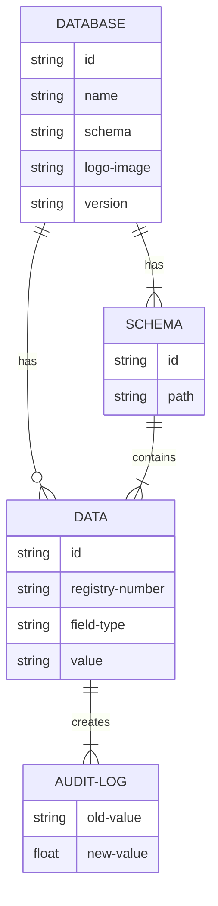

# 7 Data Structures

## 7.1 Standards/Protocols <a href="#docs-internal-guid-1e590c21-7fff-9d6f-674a-fa9e678943e1" id="docs-internal-guid-1e590c21-7fff-9d6f-674a-fa9e678943e1"></a>

The following standards are applicable to data structures in the Digital Registries Building Block:

1. All dates should follow [ISO 8601](http://en.wikipedia.org/wiki/ISO\_8601).
2. [RFC 7159](https://www.rfc-editor.org/rfc/rfc7159) - The JavaScript Object Notation (JSON).
3. Open -API Version [3.0.0, 3.0.1, 3.1.0.](https://www.openapis.org/)

## 7.2 Resource Model

The resource model shows the relationship between data objects that are used by this Building Block.

**Resource Model**:

 (1).JPG>)



## 7.3 Data Elements <a href="#docs-internal-guid-f4ace18b-7fff-ada5-ebbb-3aaf5e08cb17" id="docs-internal-guid-f4ace18b-7fff-ada5-ebbb-3aaf5e08cb17"></a>

The Data Elements provide detail for the Resource Model defined above. This section will list the core/required fields for each resource. Note that the Data Elements can be extended for a particular use case, but they must always contain, at the minimum, the fields defined here.

**Minimum Required Data:**

| Name                | Description                                                                                             | Type                                  | Required |   |
| ------------------- | ------------------------------------------------------------------------------------------------------- | ------------------------------------- | -------- | - |
| Database ID         | Unique identifier of a database.                                                                        | integer                               | yes      |   |
| Database name       | Name that will define the database content. Name is public.                                             | varchar                               | yes      |   |
| Database schema     | Database schema. See example in Chapters 7.4.1 and 7.4.2.                                               | json                                  | yes      |   |
| Database logo       | Visual image for the database.                                                                          | bytea                                 | no       |   |
| Version             | Database version. Each change in schema will produce the next version of the database and API services. | numeric                               | yes      |   |
| Catalogue name      | Database name in the list.                                                                              | varchar                               | yes      |   |
| Data ID             | Data element unique identifier.                                                                         | integer                               | yes      |   |
| Registry number     | Additional registry identifier. Unique identifier in the registry.                                      | varchar                               | yes      |   |
| Field type          | Field type: datetime, date, boolean, text, number, file.                                                | varchar                               | yes      |   |
| Field value         | Field value, data stored in the field.                                                                  | datetime, date, boolean, text, number | yes      |   |
| Audit log old value | Field value before change.                                                                              | datetime, date, boolean, text, number | yes      |   |
| Audit log new value | Field value after the change.                                                                           | datetime, date, boolean, text, number | yes      |   |


### 7.4 Schema examples

#### 7.4.1 Database Read Schema Response Example

```
{
  "id": 353,
  "version": "2.7",
  "name": null,
  "description": null,
  "institution": null,
  "number_format": "{code}{indexNoByCode}",
  "schema": {
    "type": "object",
    "properties": {
      "ID": {
        "type": "string",
        "triggers": [
          {
            "conditions": [
              {
                "logic": "==",
                "value": "",
                "gate": "&&"
              }
            ],
            "actions": [
              {
                "type": "set-value",
                "value": "MCTS{indexNoByCode}",
                "field_id": 1
              },
              {
                "type": "upper-case",
                "field_id": 1
              }
            ]
          }
        ],
        "primaryKey": true,
        "readOnly": true,
        "description": "Registration ID",
        "example": "MCTS31",
        "$id": 1
      },
      "Child": {
        "type": "object",
        "properties": {
          "ID": {
            "type": "string",
            "description": "Child ID",
            "example": "ID2",
            "$id": 13
          },
          "Firstname": {
            "type": "string",
            "description": "Child first name",
            "example": "Usha",
            "$id": 3
          },
          "Lastname": {
            "type": "string",
            "description": "Child last name",
            "example": "Bajaj",
            "$id": 4
          },
          "Birthdate": {
            "type": "string",
            "format": "date",
            "description": "Child data of birth",
            "example": "2021-10-03T07:03:36Z",
            "$id": 5
          },
          "Address": {
            "type": "string",
            "description": "Child's address",
            "example": "Longroad 123, Welltown, Ethiopia",
            "$id": 7
          },
          "Birth_certificate": {
            "type": "file",
            "consumes": [
              "application/pdf",
              "image/jpeg",
              "image/png",
              "image/gif",
              "image/tiff",
              "image/bmp",
              "image/x-ms-bmp",
              "application/rtf",
              "text/rtf",
              "application/vnd.openxmlformats-officedocument.wordprocessingml.document",
              "application/vnd.oasis.opendocument.text"
            ],
            "antivirus": true,
            "description": "Child's birth certificate data. ISO8601/UTC",
            "example": "2021-10-03T07:03:36Z",
            "$id": 6
          },
          "Citizenship": {
            "type": "string",
            "description": "Child is a citizen of this country. ISO 3166-1 encoding list",
            "example": "ET",
            "$id": 20
          }
        },
        "description": "Child object data that is queried from database",
        "$id": 2
      },
      "Registration date": {
        "type": "string",
        "format": "date",
        "description": "Record registration date",
        "example": "2021-10-03T07:03:36Z",
        "$id": 14
      },
      "Expiry date": {
        "type": "string",
        "format": "date",
        "description": "Record expiry date",
        "example": "2021-10-03T07:03:36Z",
        "$id": 15
      },
      "Caretaker": {
        "type": "object",
        "properties": {
          "ID": {
            "type": "string",
            "description": "Caretaker's ID",
            "example": "ID1",
            "$id": 12
          },
          "Firstname": {
            "type": "string",
            "description": "Caretaker's first name",
            "example": "Sowmya",
            "$id": 9
          },
          "Lastname": {
            "type": "string",
            "description": "Caretaker's last name",
            "example": "Bajaj",
            "$id": 10
          },
          "Birthdate": {
            "type": "string",
            "format": "date",
            "description": "Caretaker's birth date",
            "example": "2021-10-03T07:03:36Z",
            "$id": 16
          },
          "Phone": {
            "type": "string",
            "description": "Caretaker's phone number",
            "example": "+3725278511",
            "$id": 11
          },
          "Email": {
            "type": "string",
            "description": "Caretaker's email",
            "example": "test@test.et",
            "$id": 17
          },
          "Picture": {
            "type": "file",
            "consumes": [
              "application/pdf",
              "image/jpeg",
              "image/png",
              "image/gif",
              "image/tiff",
              "image/bmp",
              "image/x-ms-bmp",
              "application/rtf",
              "text/rtf",
              "application/vnd.openxmlformats-officedocument.wordprocessingml.document",
              "application/vnd.oasis.opendocument.text"
            ],
            "antivirus": true,
            "description": "Caretaker's picture.",
            "$id": 18
          },
          "Document ID": {
            "type": "file",
            "consumes": [
              "application/pdf",
              "image/jpeg",
              "image/png",
              "image/gif",
              "image/tiff",
              "image/bmp",
              "image/x-ms-bmp",
              "application/rtf",
              "text/rtf",
              "application/vnd.openxmlformats-officedocument.wordprocessingml.document",
              "application/vnd.oasis.opendocument.text"
            ],
            "antivirus": true,
            "description": "Caretaker's document",
            "$id": 19
          }
        },
        "description": "Caretaker's information",
        "$id": 8
      }
    },
    "$incrementIndex": 20,
    "required": [
      "ID"
    ]
  },
  "schema_tags": [
    {
      "name": "",
      "path": "/Child/Citizenship",
      "is_fulltext": true
    },
    {
      "name": "",
      "path": "/Child/Lastname",
      "is_fulltext": true
    },
    {
      "name": "",
      "path": "/Child/Firstname",
      "is_fulltext": true
    },
    {
      "name": "",
      "path": "/ID",
      "is_fulltext": true
    }
  ],
  "schema_flags": [
    {
      "name": "mandatory",
      "path": "/ID"
    },
    {
      "name": "unique",
      "path": "/ID"
    }
  ],
  "fields_uniques": [
    []
  ],
  "is_draft": false,
  "is_disabled": false,
  "is_archived": false,
  "modified_at": "2021-10-03T08:35:01.775915Z",
  "by_user_name": "ingmar.dev",
  "by_user_auth_id": 1,
  "by_on_behalf_of_user_auth_id": null,
  "by_on_behalf_of_user_name": null,
  "generic_services": [
    {
      "service_id": 1,
      "name": "data-create",
      "is_visible": true,
      "used_count": 0
    },
    {
      "service_id": 2,
      "name": "data-read",
      "is_visible": true,
      "used_count": 0
    },
    {
      "service_id": 9,
      "name": "data-read-value",
      "is_visible": true,
      "used_count": 0
    },
    {
      "service_id": 3,
      "name": "data-list",
      "is_visible": true,
      "used_count": 0
    },
    {
      "service_id": 4,
      "name": "data-update",
      "is_visible": true,
      "used_count": 0
    },
    {
      "service_id": 6,
      "name": "data-delete",
      "is_visible": true,
      "used_count": 0
    },
    {
      "service_id": 7,
      "name": "data-exists",
      "is_visible": true,
      "used_count": 0
    },
    {
      "service_id": 10,
      "name": "data-update-or-create",
      "is_visible": true,
      "used_count": 0
    },
    {
      "service_id": 11,
      "name": "data-update-entries",
      "is_visible": true,
      "used_count": 0
    },
    {
      "service_id": 12,
      "name": "data-create-entries",
      "is_visible": true,
      "used_count": 0
    },
    {
      "service_id": 13,
      "name": "data-update-or-create-entries",
      "is_visible": true,
      "used_count": 0
    }
  ],
  "data_index_increment": 0,
  "has_logo": false
}
```

#### 7.4.2 Example Schema With Foreign Keys

```
{
    "id": 185,
    "version": "1.0",
    "name": null,
    "description": null,
    "institution": null,
    "number_format": "{code}{indexNoByCode}",
    "schema": {
        "type": "object",
        "properties": {
            "ID": {
                "type": "string",
                "triggers": [{
                    "conditions": [{
                        "logic": "==",
                        "value": "",
                        "gate": "&&"
                    }],
                    "actions": [{
                            "type": "set-value",
                            "value": "{code}{indexNoByCode}",
                            "field_id": 1
                        },
                        {
                            "type": "upper-case",
                            "field_id": 1
                        }
                    ]
                }],
                "primaryKey": true,
                "readOnly": true,
                "$id": 1
            },
            "Client ID": {
                "type": "string",
                "$id": 5
            },
            "Client first name": {
                "type": "string",
                "$id": 6
            },
            "Client last name": {
                "type": "string",
                "$id": 7
            },
            "Client date of birth": {
                "type": "string",
                "format": "date",
                "$id": 8
            },
            "Prescriptions": {
                "type": "string",
                "foreignKeys": [{
                    "databaseKey": "54",
                    "values": [{
                        "fieldKey": "6"
                    }]
                }],
                "$id": 3
            }
        },
        "$incrementIndex": 13,
        "required": [
            "ID"
        ]
    }
```

