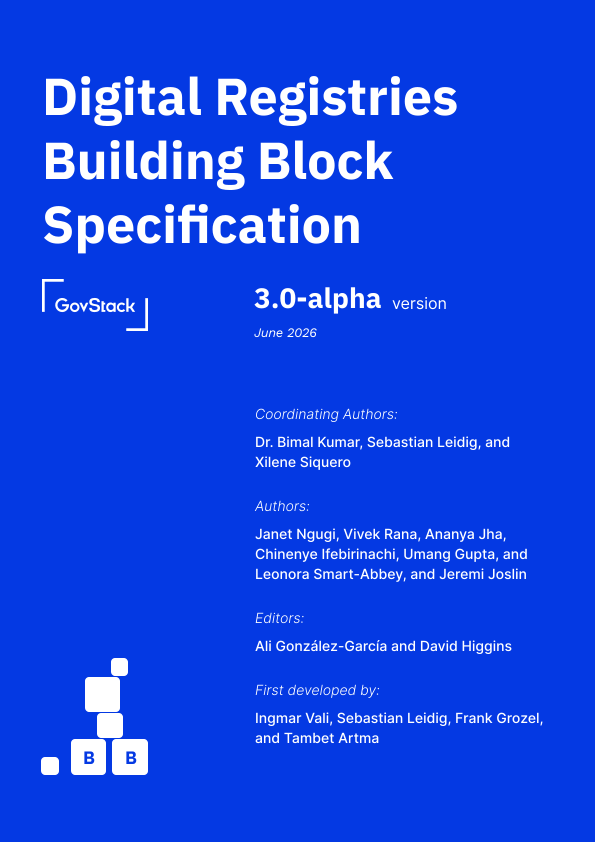

# Digital Registries Building Block Specification

_**Coordinating authors:**_\
Dr. Bimal Kumar, Xilene Siquero, and Sebastian Leidig

_**Authors:**_\
Janet Ngugi, Vivek Rana, Chinenye Ifebirinachi, Ananya Jha, Umang Gupta, and Leonora Smart-Abbey, and Jeremi Joslin

_**Editors:**_\
Ali González-García and David Higgins

***

_**First version by:**_ \
Frank Grozel (UNCTAD), Ingmar Vali (ITU), Tambet Artma (ITU), Saurav Bhattarai (GIZ), Dr. P. S. Ramkumar (ITU), Rauno Kulla (UNCTAD), and Sebastian Leidig

<figure><figcaption></figcaption></figure>
